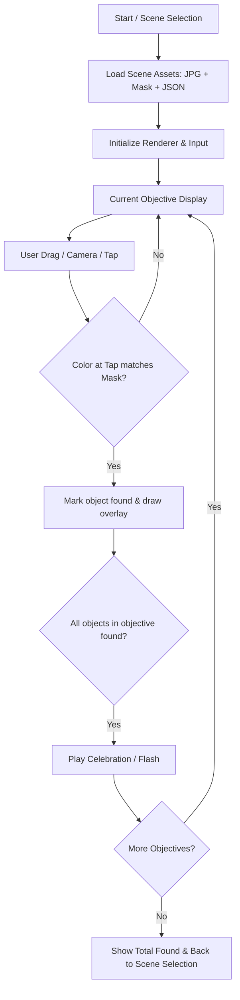
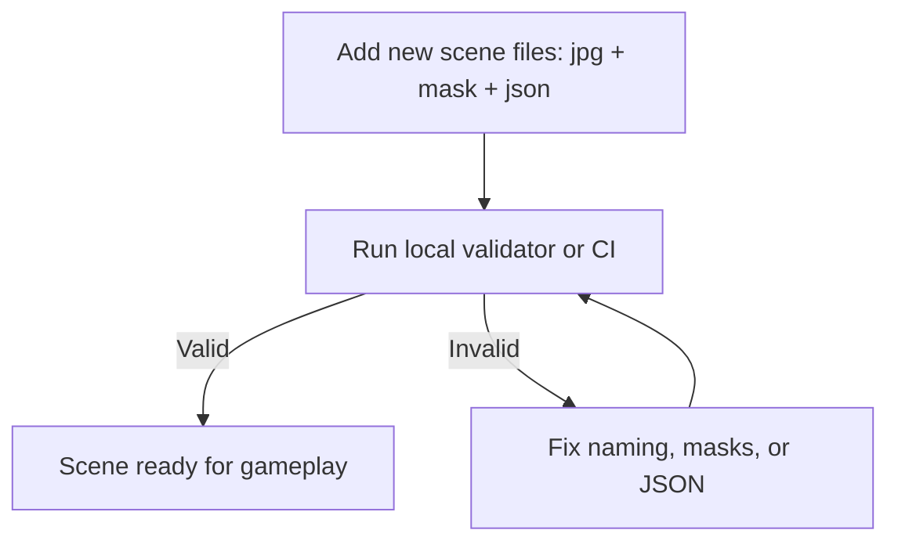

# 🦁 Wildlife Photo / Wimmelbild Game

**Project goal:**
A tablet-friendly *photo hunt game* for children (2–6), now extensible to “wimmelbild”-style tasks: find animals, planes, or other objects. Supports real photos or illustrations.

Players **pan/drag** or use a stylus to find objects in a scene and tap/click to capture them.

---

## 🗂️ Project Structure

```
.
├── index.html
├── style.css
├── src/
│   ├── main.ts
│   ├── sceneRenderer.ts
│   ├── scene.ts
│   ├── config.ts
│   └── input.ts
├── scripts/               # compiled JS output
├── assets/
│   ├── animals/*.svg
│   ├── backgrounds/*.svg or .jpg
│   └── icons/*.svg
├── scenes/
│   ├── scene_name.jpg      # full scene
│   ├── scene_name_mask.png # color-coded object positions
│   └── scene_name.json     # scene definition
├── tests/                 # jest / cypress tests
├── package.json
├── tsconfig.json
└── .github/workflows/
```

---

## ⚙️ Scene Naming Conventions

* **Base name** of scene files (jpg, png, json) must match exactly.
* **File suffixes**:

  * `.jpg` → panorama / illustration
  * `_mask.png` → color-coded overlay
  * `.json` → scene definition
* **Example**:

  ```
  jungle_adventure.jpg
  jungle_adventure_mask.png
  jungle_adventure.json
  ```
* **Identifiers** for objects are **unique names**:

  * elephant1, elephant2, lion1
  * Avoid duplicates; any type of object (planes, trees, toys…) is allowed.
* The validator checks for:

  * Missing masks or JSON
  * Duplicate object identifiers
  * Scene image & mask dimension mismatches

---

## 📝 Scene JSON Structure

```ts
{
  "name": "jungle_adventure",
  "objects": [
    { "id": "elephant1", "tags": ["elephant"], "found": false },
    { "id": "lion1",     "tags": ["lion"],     "found": false }
  ],
  "objectives": [
    { "title": "Find all 🐘", "tags": ["elephant"], "emoji": "🐘" },
    { "title": "Find all 🦁", "tags": ["lion"],     "emoji": "🦁" }
  ]
}
```

> **Note:** `id` must be unique. Tags group objects per task. `emoji` is shown for pre-readers.

---

## 🎮 Game Flow



---

## 🛠️ Developer Notes

* Modular TS code: `SceneRenderer`, `Scene`, `Input`, `Config`.
* **Mask-based detection**: allows using any image / illustration without hardcoding positions.
* Supports multiple sequential objectives in the same scene.
* Unique object IDs allow grouping and tracking progress.
* Camera / drag mechanics fully abstracted from scene content.

---

## ✅ Scene Validation Workflow



**Example GitHub Action:**

```yaml
name: Validate Scenes

on:
  push:
    branches:
      - main
  pull_request:

jobs:
  validate-scenes:
    runs-on: ubuntu-latest
    steps:
      - uses: actions/checkout@v4
      - uses: actions/setup-node@v4
        with:
          node-version: 20
      - run: npm install --include=dev
      - run: npm run validate:scenes
```

* Validator is **read-only**, fails CI if any scene is invalid.
* Can be executed locally:

  ```bash
  npm run validate:scenes
  ```

---

## 📦 Developer Quick Start

```bash
npm install
npm run build
npm run serve # or npx http-server .
```

* Open on tablet: `http://<local-ip>:8080`
* CI/CD deploys to GitHub Pages automatically.

### Quick setup for Volta on Ubuntu
```bash
# remove old nodejs/npm
sudo apt remove nodejs npm -y

# install volta
curl https://get.volta.sh | bash
exec $SHELL

# install node (latest LTS)
volta install node

# verify
node -v
npm -v
```

---

## 💡 Extending to Wimmelbilder

* Any type of object can be added: planes, toys, soccer balls, etc.
* Tasks are just **objective groups** with tags.
* Mask image color codes track hits.
* Drag-to-find replaces camera if needed.
* Supports multiple sequential objectives in a single scene.
